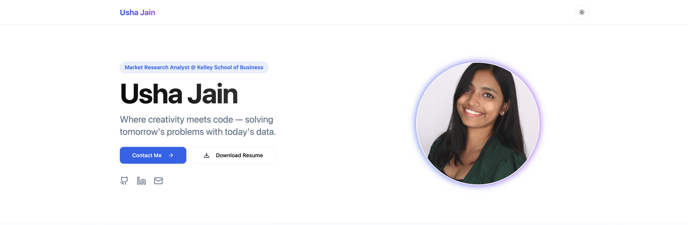

# Personal Portfolio ⚡️ 
> A clean, beautiful, responsive portfolio website for showcasing my work and projects!

> https://portfolio-usha-jains-projects.vercel.app/

 

### Website Preview

 
  <kbd>
    
  </kbd>

:star: Star me on GitHub — it helps!

## Features 📋
⚡️ Fully Responsive⚡️ Dark / Light / System Theme Toggle⚡️ Smooth Animations with Tailwind CSS⚡️ Easy to Customize⚡️ SEO Friendly

## Installation & Deployment 📦
- Clone the repository and modify the content according to your requirement.
- Install dependencies using `npm install`.
- Run locally using `npm run dev`.
- I highly recommend to use [Vercel](https://vercel.com) to deploy the website the EASIEST WAY.
- Push your code to GitHub and connect the repository to Vercel for continuous deployment.

## Sections 📚
✔️ About Me✔️ Experience✔️ Projects✔️ Skills✔️ Education✔️ Contact Information✔️ Resume

To view a live example, **[click here](https://portfolio-usha-jains-projects.vercel.app/)**

## Tools Used 🛠️
* [<b>Next.js</b>](https://nextjs.org/) - React-based Framework
* [<b>Tailwind CSS</b>](https://tailwindcss.com/) - CSS Framework
* [<b>Lucide Icons</b>](https://lucide.dev/) - Icon Library
* [<b>Vercel</b>](https://vercel.com/) - Hosting and Deployment

## Contributing 💡
#### Step 1

- 🍴 Fork this repo!
- 👯 Clone this repo to your local machine.

#### Step 2

- 🔨 Build your enhancements.

#### Step 3

- 🔃 Create a new pull request.

## License 📄
This project is licensed under the MIT License - see the [LICENSE.md](./LICENSE) file for details.
